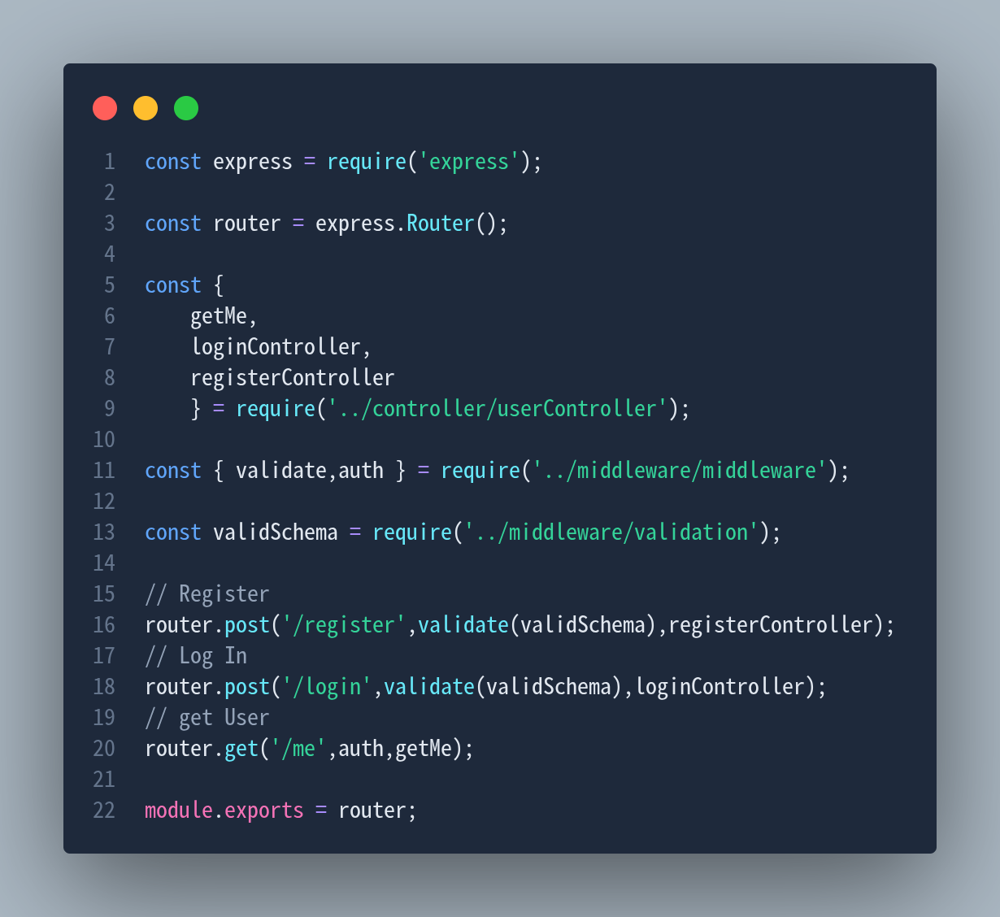

# 🔐 Auth-Sys

A RESTful Authentication API built with Node.js, Express.js, MongoDB, and JWT. This project follows the MVC architecture and provides secure user authentication with protected routes.

## 🚀 Features

- User Registration
- User Login
- JWT Authentication
- Protected User Route
- Password Hashing with bcrypt
- MongoDB Database Integration
- MVC Architecture
- Environment Variables Configuration
- Error Handling Middleware

## 🛠️ Tech Stack

- Node.js
- Express.js
- MongoDB
- Mongoose
- JWT (JSON Web Token)
- bcryptjs
- dotenv

## 📁 Project Structure

```text
Auth-Sys/
│
├── config/
│   └── db.js
│
├── controllers/
│   └── authController.js
│
├── middleware/
│   └── authMiddleware.js
│
├── models/
│   └── User.js
│
├── routes/
│   └── authRoutes.js
│
├── .env
├── .gitignore
├── app.js
├── package.json
└── README.md
```

## ⚙️ Installation

### Clone the repository

```bash
git clone https://github.com/ElMehdichamam/Auth-Sys.git
cd Auth-Sys
```

### Install dependencies

```bash
npm install
```

### Configure environment variables

Create a `.env` file in the root directory:

```env
PORT=5000
MONGO_URI=your_mongodb_connection_string
JWT_SECRET=your_secret_key
```

### Run the application

Development mode:

```bash
npm run dev
```

Production mode:

```bash
npm start
```

## 📌 API Endpoints

### Register User

```http
POST /register
```

Request Body:

```json
{
  "name": "John Doe",
  "email": "john@example.com",
  "password": "123456"
}
```

---

### Login User

```http
POST /login
```

Request Body:

```json
{
  "email": "john@example.com",
  "password": "123456"
}
```

Response:

```json
{
  "token": "jwt_token_here"
}
```

---

### Get Current User

```http
GET /me
```

Headers:

```http
Authorization: Bearer your_jwt_token
```

Response:

```json
{
  "_id": "...",
  "name": "John Doe",
  "email": "john@example.com"
}
```

## 🔒 Authentication

Protected routes require a valid JWT token.

Example:

```http
Authorization: Bearer YOUR_TOKEN
```
## API Preview




## 📚 Learning Objectives

This project helped me practice:

- REST API Development
- Authentication & Authorization
- JWT Implementation
- Password Hashing
- MongoDB & Mongoose
- Middleware Creation
- MVC Architecture
- Environment Variable Management

## 👨‍💻 Author

**El Mehdi Chamam**

GitHub: https://github.com/ElMehdichamam

## ⭐ Support

If you found this project useful, consider giving it a star on GitHub.